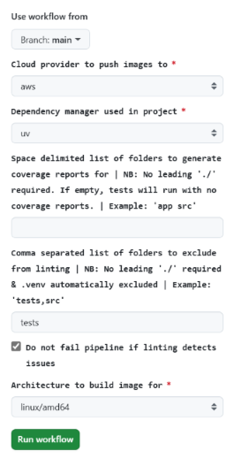
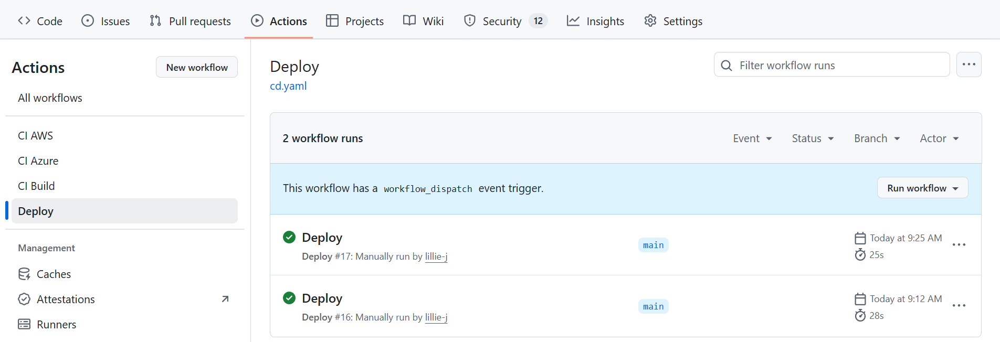

# CI/CD Workflow Templates
[](https://github.com/lillie-j/ci-cd-template/actions/workflows/ci.yaml)
[](https://github.com/lillie-j/ci-cd-template/actions/workflows/cd.yaml)


This repository contains template CI/CD workflows (GitHub Actions), intended for use in Python-based projects.

It contains a very simple application, composed of a FastAPI backend and a Streamlit frontend, intended to demonstrate the functionality of the CI/CD workflows.


# 🛠️ Continuous Integration (CI) Workflows

**Continuous Integration** is the practice of automatically building, testing, and validating code changes to ensure quality and consistency throught the software development lifecycle. It allows you to quickly and confidently integrate changes into your codebase, whilst minimising manual steps and the risk of regressions. 

GitHub Actions defines CI/CD workflows through YAML files. These files allow you to programmatically specify a sequence of steps/jobs that are executed by a runner.

This repository includes 3 CI Workflows:

Workflow Name | Path | Description | 
|-------------|------|-------------
**CI Build** | `.github/workflows/ci.yaml` | Entrypoint CI workflow – calls the correct CI workflow based on specified cloud platform (AWS or Azure)
| **CI AWS**            | `.github/workflows/ci_aws.yaml`   | CI job to build and push images to AWS ECR - do not call directly                                     |
| **CI Azure**          | `.github/workflows/ci_azure.yaml` | CI job to build and push images to Azure ACR - do not call directly                                  |


### Overview

Although the exact implementation varies depending on the cloud provider used, there are 4 common jobs in the CI workflow.
These are logically separated steps performed by the CI workflow.

#### 1. Setup 🏗️
* **What**: Installs Python, your chosen dependency manager (e.g. `uv`, `pipenv` etc.) and project dependencies.
* **Why**: Ensures your project environment is reproducible across different machines and CI runners.


#### 2. Test 🧪
* **What**: Runs all tests using `pytest`. Any test failures will cause this job to fail. Optionally generates:
  * An HTML coverage report as an artifact
  * A coverage badge like  for use in your repo. 
* **Why**: Validates that your code behaves as expected and helps catch regressions early.


#### 3. Linting 🧹
* **What**: Checks code style and quality using `flake8` and `pylint`. Can be configured to fail if any issues detected. Also generates:
  * A pylint score badge like  for use in your repo. 
* **Why**: Promotes clean, maintainable code and enforces consistent style across the project.


#### 4. Docker Build/Push 🐋
* **What**: Builds your app into a Docker Image\/Images & pushes to your cloud provider's image registry (AWS ECR or Azure ACR).
* **Why**: Packages your application as a portable artifact, enabling reproducible deployments and containerised execution

----------------------------------


### How to Use 🧑‍💻
#### Prerequisites
- [ ] **Repos Created in Cloud Image Registry**: The workflow will attempt to push images to an image registry repo which follows the following naming convention: `<GITHUB REPO>-<BUILD CONTEXT BASENAME>`. for example, if your GitHub repository is named `ci-cd-template` and you have an image/build context in `./app/backend`, the workflow will attempt to push an image to a container repository named `ci-cd-template-backend` in your cloud provider's registry. This will have 2 tags: 1 tagged with the short commit SHA, 1 tagged with 'latest'

- [ ] **GitHub Actions IAM Service Principal Permissions**: This must have permissions to interact with your image registry

#### 1. Clone Repo
The following folders need to be copied into your repo to make this workflow available

```py
# Clone the template repository
git clone https://github.com/lillie-j/ci-cd-template.git

# Copy required files into your project
cp -r ci-cd-template/.github <path/to/your/repo>
cp ci-cd-template/requirements.ci.txt <path/to/your/repo>
```

#### 2. Set Secrets

To push Docker images to a cloud registry, define the following secrets in your GitHub repository using **GitHub Secrets**. For simplicity, access to cloud resources is expected via a service principal rather than OIDC federation.


| Cloud Provider   | Image Registry     | Secret Names                |
|------------------|--------------------|--------------------------|
| **AWS**  | Elastic Container Registry | AWS_ACCESS_KEY_ID, AWS_SECRET_ACCESS_KEY,AWS_REGION                  
| **Azure** | Azure Container Registry | AZURE_CREDS, AZURE_REGISTRY_NAME 


#### 3. Set Matrix Variables
Matrix builds allow parallel execution of jobs with different inputs, improving efficiency. In this workflow, the Docker Build job uses a matrix strategy to build multiple images concurrently.

Each matrix entry defines a build context, which is the directory used as the root for the Docker build. The Dockerfile for each image must reside within its corresponding build context.

Dynamic inputs cannot be injected into matrix variables. Therefore, all matrix values must be explicitly defined within the workflow file.

⚠️ **ACTION REQUIRED**: To configure the matrix, manually specify the build context paths in the workflow YAMLs as shown below. Update these paths to match the structure and requirements of your project:


`ci-aws.yaml` or `ci-azure.yaml`
```
  Docker_Build:
    needs: Test
    runs-on: ubuntu-latest
    strategy:
      fail-fast: false
      matrix:
        context: ["./app/backend","./app/frontend"] #EDIT THIS VARIABLE
        # Each path should point to a folder containing a Dockerfile.
        # Each Dockerfile is assumed to be in the same folder as its build context.
```

#### 4. Workflow Dispatch
The CI Build workflow should be triggered via a workflow dispatch (manual trigger) in GitHub Actions.


Although workflows can be triggered by pushes to branches or pull requests, this workflow can only be triggered by a workflow dispatch for the following reasons: 
1. **Controlled Input**: Workflow Dispatch allows you to specify inputs in a controlled manner, without having to manually edit files in line
2. **Cost & Resource Efficiency**: Automatically triggering builds on every push or pull request can lead to excessive usage and increased costs.

Click 'Run Workflow' and provide inputs as instructed.




#### A Note on Defaults:
To simplify CI builds, default values have been provided for certain inputs. These may not be applicable to your project and may actually add inconvenience.

To modify default values, please edit the default entries in `ci.yaml`

```yaml
on:
  workflow_dispatch:
    inputs:
      exclude_folders_from_linting:
        description: "
          Comma separated list of folders to exclude from linting
          NB: No leading './' required & .venv  automatically excluded
          Example: 'tests,src'"
        required: false
        type: string
        default: tests

      ignore_linting_failures:
        description: "Do not fail pipeline if linting detects issues"
        required: false
        type: boolean
        default: true

      build_platform:
        description: "Architecture to build image for"
        required: true
        type: choice
        options: [linux/amd64, linux/arm64]
        default: linux/amd64
```

-------------------------------------------
# 🚀 Continuous Deployment (CD) Workflows

Continuous Deployment is the practice of automatically releasing validated code changes to a target environment once they pass all required checks in CI. It extends the principles of CI by eliminating manual deployment steps, enabling faster and more reliable delivery of software.


This repository includes 3 CD Workflows:

Workflow Name | Path | Description | 
|-------------|------|-------------
**Deploy** | `.github/workflows/cd.yaml` | Entrypoint CD workflow – calls the correct CD workflow based on specified cloud platform (AWS or Azure)
| **CD AWS**            | `.github/workflows/cd_aws.yaml`   | CD job to deploy to Elastic Beanstalk - do not call directly                                     |
| **CD Azure**          | `.github/workflows/cd_azure.yaml` | CD job to deploy to Azure Web Apps - do not call directly                                  |

### Overview

Although images can be deployed in a number of ways (e.g. container services like Azure Container Apps, AWS ECS; Kubernetes services like AKS, EKS etc.), for simplicity's sake, and because this setup is intended for demonstrators rather than production workloads, this workflow will use the cloud provider's managed application service.

### How to Use 🧑‍💻

This assumes that you have already followed steps 1 & 2 in the 'How to Use' section for CI Workflows.

#### AWS Prerequisites
- [ ] **Elastic Beanstalk Envioronment Created**: App needs to be deployed in an Elastic Beanstalk environment.
- [ ] **Elastic Beanstalk App Created**: Deployment will update version of an Elastic Beanstalk App which already exists & redeploy.
- [ ] **Ensure docker-compose.yml points to correct images** Update docker compose.yml to point to correct images. For simplicity, the CI workflow will always push an image with a `:latest` tag.
- [ ] **S3 Bucket for Source Bundle Created**: App must be deployed from a source bundle (zipped `docker-compose.yml`) stored in a S3 bucket
- [ ] **IAM Instance Profile for Elastic Beanstalk Created**: This must have permissions to read from ECR
- [ ] **GitHub Actions IAM Service Principal Permissions**: This must have permissions to interact with your resources (Elastic Beanstalk, ECR, S3)

#### Azure Prerequisites
- TBC

Please refer to `./terraform` for further guidance


#### 1. Workflow Dispatch
The Deploy workflow should be triggered via a workflow dispatch (manual trigger) in GitHub Actions.


Click 'Run Workflow' and provide inputs as instructed.



--------------------------------------

# General Design Considerations
The following design patterns were considered when creating workflows.
#### 1. Job Based Workflow Structure

Workflows are split into distinct jobs (e.g., Setup, Test, Linting, Docker Build), each representing a logical unit of work. 

* **Dependency Control**: Jobs can be configured to run only if prerequisite jobs succeed. For example, the Docker Build job will only execute if tests pass, preventing unnecessary builds.
* **Parallel Execution**: Independent jobs (e.g., Linting and Testing) can run concurrently, reducing overall workflow duration.
* **Clear Separation of Concerns**: Each job focuses on a single responsibility, making the workflow easier to understand and maintain.

#### 2. Caching for Dependency Management

To avoid reinstalling dependencies on every run, workflows uses caching mechanisms.

* **Speed Optimisation**: Cached dependencies significantly reduce setup time, especially in large projects with many packages.

#### 3. Matrix Builds for Parallelisation
Matrix variables are used to run multiple instances of a job (Docker Build) in parallel with differnt inputs. 

* **Speed Optimisation**: Reduces total build time

#### 4. Composite Actions for Modularity

Reusable composite actions are defined in .github/actions, encapsulating common sequences of steps:

* **Encapsulation**: Complex logic is abstracted into their own action.yaml files, improving readability in the main workflow file.
* **Reusability**: These actions can be reused across multiple workflows or repositories (theoretically...).
* **Maintainability**: Changes to shared logic only need to be made in one place.

#### 5. Script Abstraction for Maintainability
Where appropriate, shell scripts are abstracted into standalone .sh files (rather than defined inline in YAML) and invoked from workflows.

* **Testing**: Easier to test locally without triggering a workflow.
* **Maintainability**: Cleaner and more readable YAML & promotes reuse of scripts
